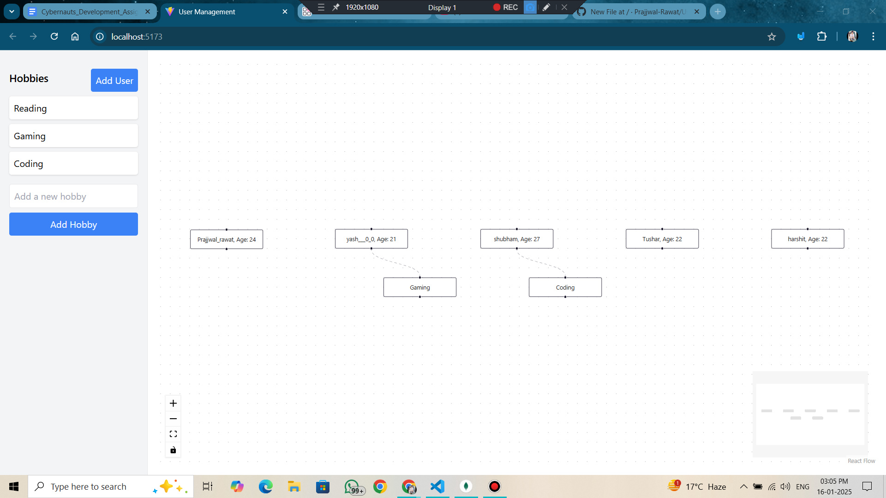

<h1><b>User Management Flow Application</b></h1>
 <!-- Replace with your own banner screenshot -->

This is a React-based application that visualizes users and their hobbies using ReactFlow. It allows users to interact with a flow of users and hobbies, adding new hobbies to users and deleting nodes from the system. Changes are automatically reflected in the backend database via API requests.

<h2><b>Features:</b></h2>
<ul> <li><b>Add Hobby</b>: Drag and drop hobbies to users.</li> <li><b>Delete Hobby or User</b>: Right-click on any node (user or hobby) to delete it from both the UI and the database.</li> <li><b>Dynamic Node Positioning</b>: Nodes are dynamically arranged with hobbies stacked below their respective users.</li> <li><b>Database Integration</b>: Changes are persisted in the database through API interactions.</li> </ul>
<h2><b>Table of Contents:</b></h2>
<ol> <li><a href="#installation"><b>Installation</b></a></li> <li><a href="#usage"><b>Usage</b></a></li> <li><a href="#api-endpoints"><b>API Endpoints</b></a></li> <li><a href="#project-structure"><b>Project Structure</b></a></li> <li><a href="#screenshots"><b>Screenshots</b></a></li> <li><a href="#license"><b>License</b></a></li> </ol>
<h2><b>Installation</b></h2>
To get started with this project, follow the steps below:

<h3><b>1. Clone the repository:</b></h3>
bash
Copy
Edit
git clone <repository-url>
cd <repository-directory>
<h3><b>2. Install dependencies:</b></h3>
Ensure that you have Node.js installed on your machine, then run:

bash
Copy
Edit
npm install
<h3><b>3. Start the development server:</b></h3>
Run the following command to start the app locally:

bash
Copy
Edit
npm start
The application will be available at http://localhost:3000.

<h2><b>Usage</b></h2>
Once the app is running, you can interact with the flow in the following ways:

<h3><b>1. Adding a Hobby to a User:</b></h3>
<b>Step 1:</b> Drag and drop a hobby onto a user node to add the hobby to the user.
 <!-- Replace with your screenshot showing hobby being added -->

<h3><b>2. Deleting a Hobby or User:</b></h3>
<b>Step 1:</b> Right-click on a hobby or user node and select <b>Delete</b> to remove it both from the UI and the database.
 <!-- Replace with your screenshot showing hobby deletion -->

<h3><b>3. User and Hobby Flow Visualization:</b></h3>
The application displays a flow where each user is represented as a node and their hobbies as child nodes connected by edges.
 <!-- Replace with your screenshot showing the user-hobby flow -->

<h2><b>API Endpoints</b></h2>
The app interacts with the backend API to manage users and hobbies.

<h3><b>1. Delete a User:</b></h3>
<b>Endpoint:</b> DELETE /api/users/:userId
<b>Description:</b> Deletes a user from the system.
<b>Request:</b>
userId is required in the URL path.
<h3><b>2. Delete a Hobby from User:</b></h3>
<b>Endpoint:</b> DELETE /api/users/:userId/hobbies
<b>Description:</b> Removes a specific hobby from a user's list.
<b>Request Body:</b>
{ "hobby": "hobbyName" }
<h3><b>3. Add a Hobby to User:</b></h3>
<b>Endpoint:</b> POST /api/users/:userId/hobbies
<b>Description:</b> Adds a new hobby to a user.
<b>Request Body:</b>
{ "hobby": "hobbyName" }
<h2><b>Project Structure</b></h2>
The project follows a standard React structure:

bash
Copy
Edit
/src
  /components
    Flow.js            # Contains the UserFlow component that renders the ReactFlow diagram
  /services
    apis.js            # API calls for adding, deleting hobbies, and users
  App.js               # Main component that handles the flow logic
  index.js             # React entry point
/public
  index.html           # HTML template for the app
  /assets
    project-banner.png # Project Banner image
    add-hobby.png      # Screenshot showing hobby being added
    delete-hobby.png   # Screenshot showing hobby deletion
    flow-visualization.png # Screenshot of the user-hobby flow visualization
